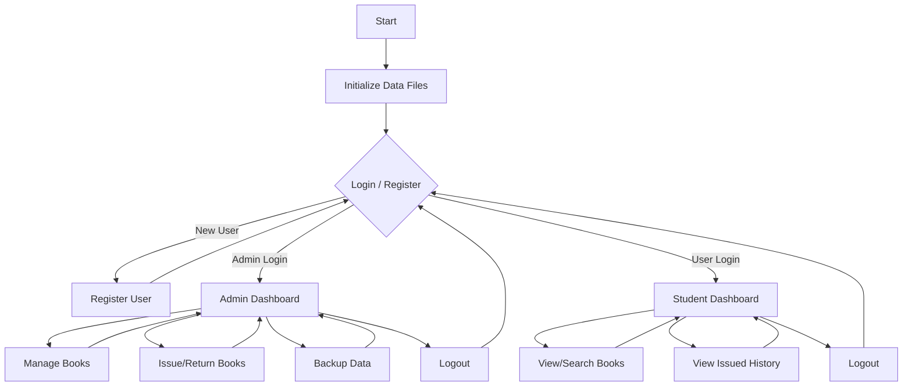

# Library Management System (C)

A modular, console-based Library Management System written in C.

## Features
- **Admin Module**: Manage books (Add, Update, Delete), Issue/Return books, View Transactions.
- **User Module**: View list of books, Search, View own issued books and fines.
- **Persistence**: All data stored in binary `.dat` files in `data/`.
- **Security**: Simple password masking and role-based login.

## Directory Structure
- `src/`: Source code (.c)
- `include/`: Header files (.h)
- `data/`: Database files (created automatically)
- `build/`: Compiled executables

## Compilation (Windows)
1. Ensure GCC is installed (MinGW).
2. Run `compile.bat`.
3. The executable `libsys.exe` will be created in `build/`.

## Compilation (Manual)
```sh
mkdir build
gcc src/*.c -I include -o build/libsys.exe
```

## First Run
1. Run the program.
2. Select "Admin Login".
3. Since no admin exists initially, you will be prompted to register a Root Admin.
4. Use these credentials to log in and manage the library.

## File Handling
- `books.dat`: Stores book records.
- `users.dat`: Stores user credentials.
- `transactions.dat`: Stores issue/return history.

## System Logic Flowchart


## Viva-Ready Explanation

### File Handling
The system uses **Binary Files (`.dat`)** to store data. We use `fread`, `fwrite`, and `fseek` for efficient data access. Binary files are chosen over text files because they are faster, more compact, and preserve the structure of the data directly.

### Data Structures
- **Structs**: We use custom structures for `Book`, `User`, `Date`, and `Transaction` to group related data.
- **Enums**: Used for `UserRole` to distinguish between Admin and Student.

### Algorithms
- **Linear Search**: Used for searching books by title or author, allowing partial matches.
- **Binary Search**: Used for searching books by ID. This is highly efficient (O(log n)) but requires the data to be sorted.
- **Sorting**: We use the standard library `qsort` with a custom comparator to keep the book inventory sorted by ID.
- **Date Comparison**: A custom date subtraction algorithm calculates the difference in days to determine if a book is overdue and compute the fine (Fine = Days Late * Rate).

### Security
- **Password Masking**: passwords are masked with `*` during input using `conio.h` for privacy.
- **Simple Encryption**: Passwords are obfuscated using a bitwise XOR operation before storage to prevent plain-text exposure in the binary files.

